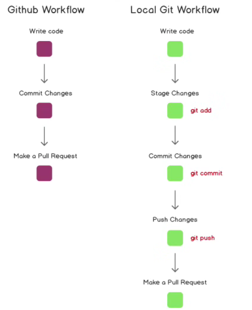
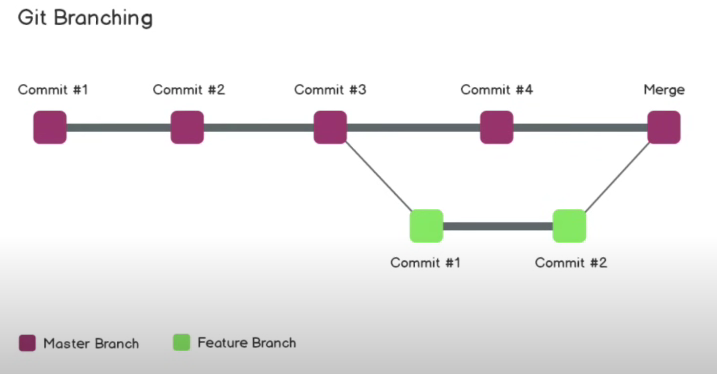

# Creating a repository

This repository was created through the VS code terminal.

# Init:

*Initializes git repository*

Use the command "git init", in the appropriate folder to initialize the repository.

# Initializing a repository locally

When pushing a local repository, the command "git push origin master" will not work as the repository was not created on github.

To fix this, an empty repository can be created on github to link this local repository to.

Once an empty repository is created, use these commands to link and push the local repository to the github repository.

"git remote add origin 'github_path'" -> Links the local repository to the github repository.

"git remote -v" -> Used to show remote repositories connected to this local repository. 

"git push -u origin master" -> Used to push the local repository. Also used an upstream, "-u", to be able to just use the "git push" command to represent the full push command.

# Git Workflows

# Branching

Branches act as commit/save paths. You are able to create multiple branches with the same code, however, each branch has no trace of each others activites.

This is best used when testing code or implementing new features. Branching acts as a safeguard in the case that a testing branch fails, it won't affect the main/production branch.

To check branches, use this command "git branch".

## Creating a branch

Use the command "git checkout -b 'branchname'".

The command "git checkout" is used to switch from branches.

*Use the last word of the branch name to auto complete*

# BRANCH TEST

This README.md file is updated through test-branch-1.

# Diffing

The "git diff 'branchname'" command shows the changes between the different versions of code on each branch.

# Merging

Before merging the two branches together, push the changes to github first.

"git push -u origin 'branchname'"

# Pull Request

*Best managed through github*

A request to pull your code into another branch. Other people will be able to view the changes before merging them into the main branch.

After making a pull request, you are still able to make changes and commits as long as you are still in the test branch.

After your code is merged, the test branch should be deleted. Then you switch back to the master branch.

To make new changes to the code, you start the process of creating a new branch and merging the branch to the master branch all over again.

# Branch Merging Workflow

Create test branch >> Make changes to code >> add, commit, and push changes in the test branch >> create a pull request >> finalize changes >> merge pull request >> pull modified code into local machine using "git pull" in the master branch >> delete test branch "git branch -d 'branchname'

# Merge Conflicts

Merge conflicts happen when there are multiple people working on a project and happen to modify the same code. When this happens, a branch merge will not be accepted until the conflict is resolved.

## Resolving Conflicts

After making changes to your code, use the command "git diff master" from the test branch to compare the two versions. 

Use the command "git merge master" and an interface will popup on VS code showing the changes. You must choose which change to accept and then commit and push the change. 

# Undoing 

When committing and adding files, sometimes we have to undo our actions.

To undo an add, use "git reset". This will work as long as the file has not been committed yet.

To undo a commit, use:

"git reset HEAD" -> resets the most recent commit.

"git reset HEAD~1" -> resets commit 1 place before the most recent commit.

"git reset 'commitHashCode'" -> unstages the changes from that commit.

"git reset --hard 'commitHashCode'" -> unstages and completely resets the state of your code to the next commit.

# Forking 

Forking is the process of cloning a whole repository. 

This can be used to add your own changes to an existing repository without disrupting the existing code/branch structures.